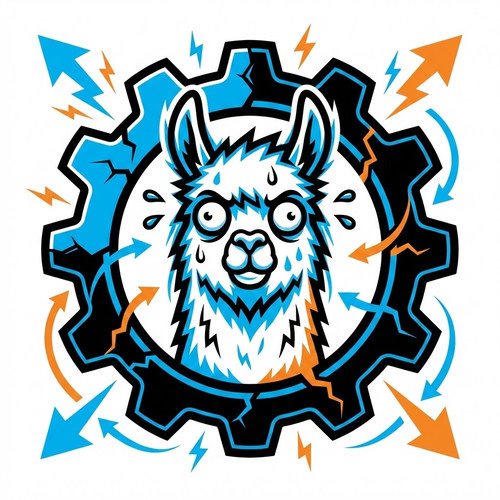
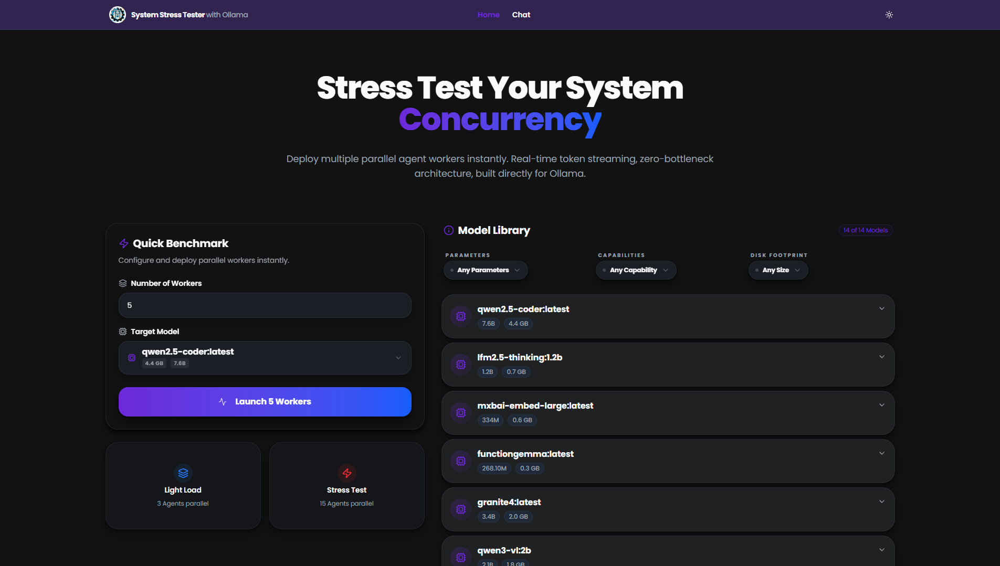
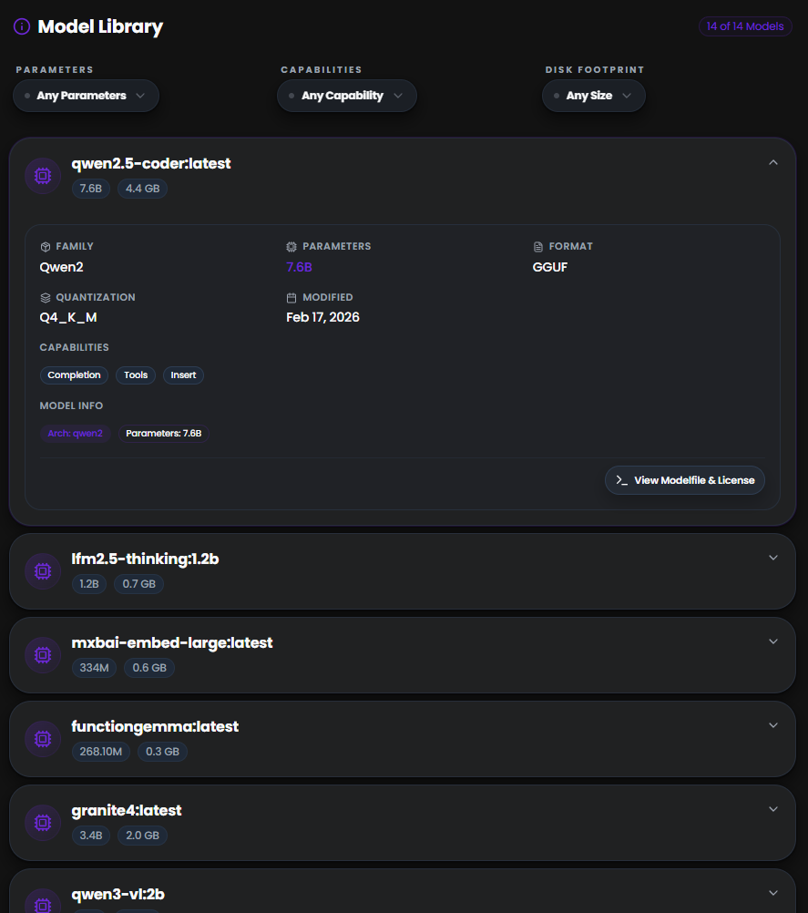
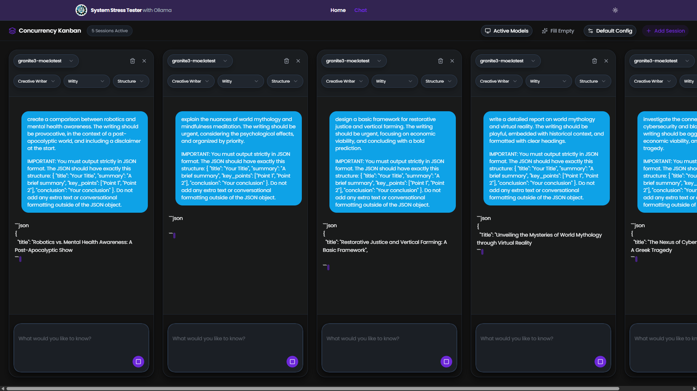
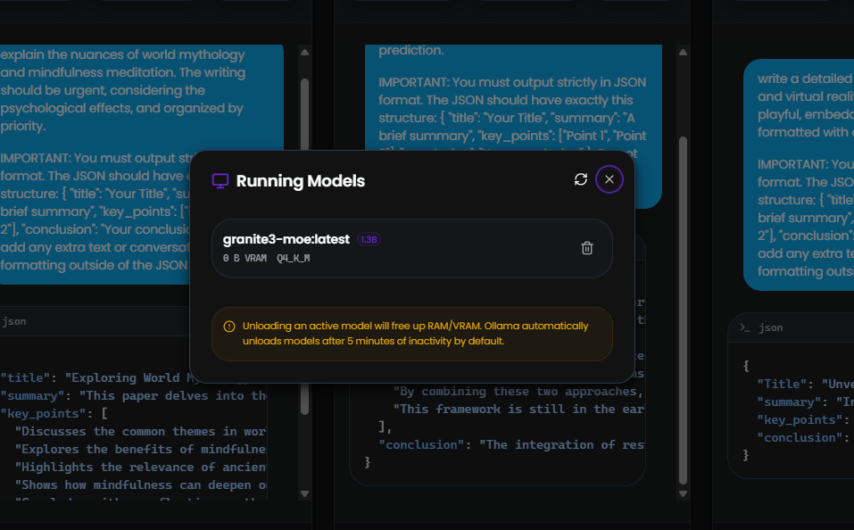
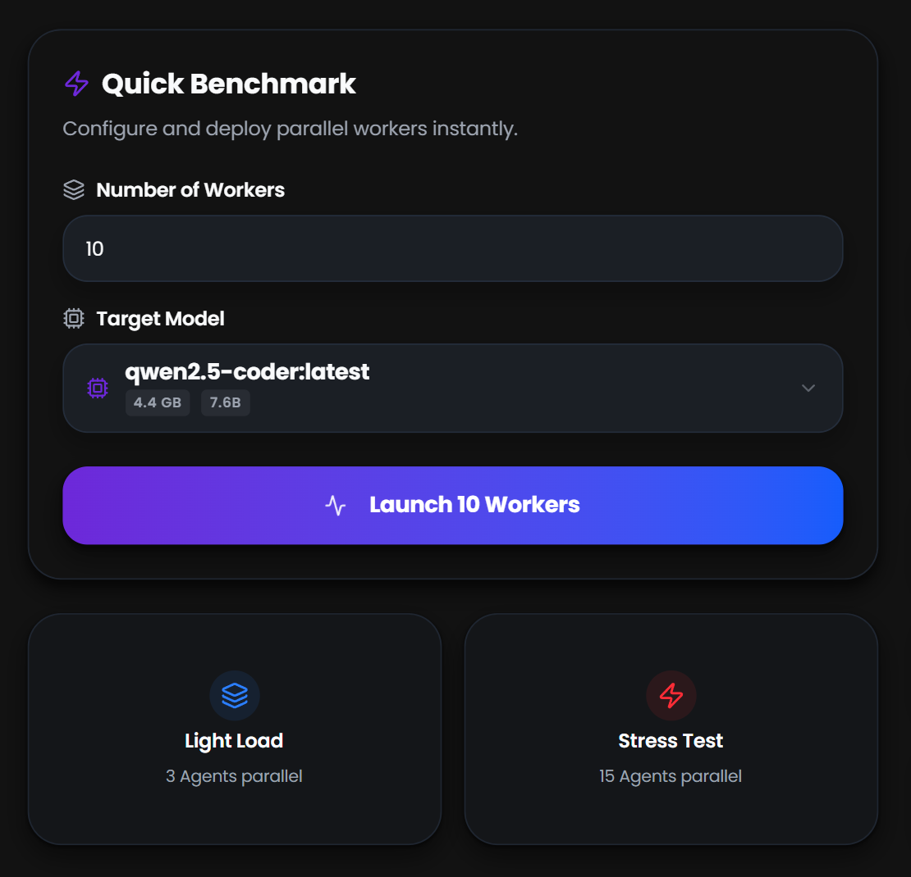
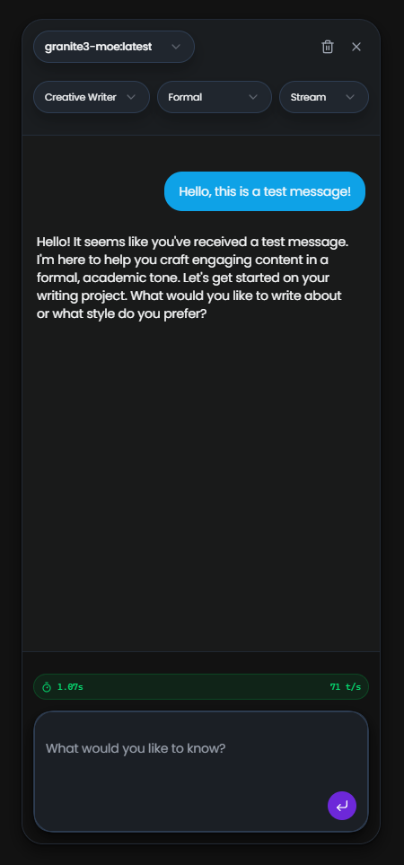

<p align="center">
  
</p>

# System Stress Tester with Ollama

A high-concurrency GUI for stress testing system performance and connectivity with local Ollama LLM/SLM models. Deploy multiple parallel agent workers, stream responses in real-time, inspect model specifications, and measure system throughput -- all from a premium, responsive web interface.

Built as a testing harness for [Deep Researcher V2](https://github.com/pixelThreader).



---

## Table of Contents

- [Overview](#overview)
- [Features](#features)
- [Architecture](#architecture)
- [Prerequisites](#prerequisites)
  - [Enabling Concurrency in Ollama](#enabling-concurrency-in-ollama)
- [Installation](#installation)
- [Usage](#usage)
  - [Home Page](#home-page)
  - [Chat Page — Concurrency Kanban](#chat-page--concurrency-kanban)
- [Configuration](#configuration)
  - [System Prompts](#system-prompts)
  - [Personalities](#personalities)
  - [Default Session Config](#default-session-config)
- [Project Structure](#project-structure)
- [Tech Stack](#tech-stack)
- [License](#license)

---

## Overview

Ollama exposes local LLMs through a REST API on `localhost:11434`. This application provides a graphical interface to push those models to their limits: spawn N concurrent chat sessions, stream tokens in parallel, compare response times, and inspect model metadata -- without writing a single line of code.

The GUI is intentionally built so that end users do not need to interact with the terminal or raw API calls to run performance tests.

---

## Features

### Model Library and Inspection

- Auto-discovers all locally pulled Ollama models on startup.
- Displays parameter count, quantization level, format, family, and disk footprint for each model.
- Filter models by **parameters** (< 5B, 5B-14B, > 14B), **capabilities** (chat, embedding, vision, tools, etc.), and **disk size** (< 2 GB, 2-10 GB, > 10 GB).
- Expand any model to view full technical specifications, capabilities badges, and architecture details.
- View the raw Modelfile and license information in a dedicated modal.



### Concurrency Kanban

- Launch 1 to 15 parallel agent workers, each in its own Kanban-style card.
- Every session runs in its own **Web Worker**, ensuring that token streaming for one session never blocks another.
- Three execution modes per session:
  - **Stream** -- real-time token-by-token output via `/api/chat` with `stream: true`.
  - **Generate** -- single-shot response via `/api/generate`.
  - **Structured** -- forces JSON schema output for typed responses.
- Per-session controls: model selector, system prompt, personality, prompt input, image attachments (for vision-capable models), and abort.
- Global controls: Bulk Send (fire all sessions at once), Fill Empty (populate all prompts with randomized stress-test prompts).




### Active Models Monitor

- View all models currently loaded in RAM/VRAM.
- Displays memory consumption (RAM and VRAM), parameter size, quantization, and expiry timer.
- Unload individual models from memory directly from the UI.
- Auto-refreshes on open to reflect the current server state.



### Session Configuration

- **10 system prompts** included out of the box: General Assistant, Code Assistant, Creative Writer, Research Analyst, Tutor, Summarizer, Translator, DevOps Engineer, Benchmark Assistant, and a raw "No System Prompt" mode.
- **11 personality modifiers**: Neutral, Friendly, Concise, Detailed, Socratic, Enthusiastic, Formal, Witty, ELI5, Pirate, and None.
- Default configuration modal lets you set the model, system prompt, personality, mode, and initial prompt for all new sessions at once. Persisted to `localStorage`.

### Performance Metrics

- Global metrics bar in the Kanban header: total tokens generated, number of actively generating sessions (with live pulse indicator).
- Per-session stats rendered after each completion: total duration, load duration, prompt eval count, eval count, and tokens-per-second.

### Design and UX

- Dark mode and light mode toggle.
- Glassmorphism, gradient backgrounds, and Framer Motion animations throughout.
- Responsive layout from mobile to ultrawide.
- Markdown rendering via Streamdown with syntax-highlighted code blocks (Shiki), math, and Mermaid diagram support.
- Vision model support: attach images to prompts when a vision-capable model is selected.

---

## Architecture

```
Browser (React SPA)
  |
  |-- Home Page
  |     |-- Model Library (listModels + showModel)
  |     |-- Quick Launch -> navigates to /chat?workers=N&model=X
  |
  |-- Chat Page (Concurrency Kanban)
  |     |-- SessionCard (x N)
  |     |     |-- Web Worker (agentWorker.ts)
  |     |     |     |-- streamChat() / generate() / generateStructured()
  |     |     |     |-- Posts chunks back to main thread via postMessage
  |     |     |-- rAF-batched state updates (zero jank)
  |     |
  |     |-- Active Models Modal (listRunningModels, unloadModel)
  |     |-- Default Config Modal (localStorage)
  |
  |-- Ollama Client (src/lib/ollamaClient.ts)
        |-- Official Ollama JS SDK
        |-- Connects to http://localhost:11434
        |-- Concurrent-safe, streaming-first design
```

Each session card spawns a dedicated Web Worker (`src/workers/agentWorker.ts`). The worker performs the actual fetch and streaming against the Ollama API, then posts token chunks back to the main thread. The main thread batches UI updates via `requestAnimationFrame` to maintain 60fps even under heavy load (20+ simultaneous streams).

---

## Prerequisites

1. **Node.js** >= 18
2. **Ollama** installed and running locally.
   - Install: [https://ollama.com](https://ollama.com)
   - Pull at least one model:
     ```bash
     ollama pull gemma3
     ```
   - Verify the server is running:
     ```bash
     ollama list
     ```

The application connects to `http://localhost:11434` by default.

### Enabling Concurrency in Ollama

By default, Ollama processes requests sequentially -- one prompt at a time. To take full advantage of parallel agent workers, you must configure two environment variables before starting the Ollama server:

| Variable                  | Purpose                                                                                          | Recommended Value |
|---------------------------|--------------------------------------------------------------------------------------------------|-------------------|
| `OLLAMA_NUM_PARALLEL`     | Number of requests a **single loaded model** can handle concurrently.                            | Match your worker count (e.g. `8`) |
| `OLLAMA_MAX_LOADED_MODELS`| Maximum number of **distinct models** kept in memory simultaneously.                             | `2` or more if testing multiple models |

**Setting the variables:**

Linux / macOS:
```bash
export OLLAMA_NUM_PARALLEL=8
export OLLAMA_MAX_LOADED_MODELS=2
ollama serve
```

Windows (PowerShell):
```powershell
$env:OLLAMA_NUM_PARALLEL = "8"
$env:OLLAMA_MAX_LOADED_MODELS = "2"
ollama serve
```

To persist these across reboots, add them to your shell profile (`.bashrc`, `.zshrc`) or set them as system environment variables on Windows.

**What changes when these variables are set:**

- **Without them:** Ollama queues incoming requests internally. If you launch 10 workers, only one actually generates at a time; the remaining 9 wait in a FIFO queue. Streaming appears sequential, and stress test results will not reflect true parallel throughput.
- **With `OLLAMA_NUM_PARALLEL=N`:** The model processes up to N requests simultaneously. All N workers stream tokens at the same time, giving you an accurate picture of how the model (and your hardware) handle concurrent load. Note that higher parallelism increases VRAM usage proportionally -- each parallel slot requires its own KV-cache allocation.
- **With `OLLAMA_MAX_LOADED_MODELS=M`:** Ollama keeps up to M models loaded in memory at once. Without this, switching between models in different sessions triggers repeated load/unload cycles, adding significant latency. Setting this higher lets you run heterogeneous tests (different models across sessions) without cold-start penalties.

**Important:** Setting `OLLAMA_NUM_PARALLEL` too high relative to your available VRAM will cause out-of-memory errors or force the model to fall back to CPU inference, which drastically reduces throughput. Start with a conservative value (4-6) and increase incrementally while monitoring GPU memory usage.

---

## Installation

```bash
# Clone the repository
git clone https://github.com/pixelThreader/Ollama-Model-GUI-Tests.git
cd Ollama-Model-GUI-Tests

# Install dependencies
npm install

# Start the development server
npm run dev
```

The application will be available at `http://localhost:5173`.

---

## Usage

### Home Page

The landing page presents two main sections:

**Quick Benchmark** (left panel)
1. Set the number of workers (1-15).
2. Select a target model from the dropdown. Each option shows the model name, parameter count, and disk size.
3. Click "Launch N Workers" to navigate to the Chat page with pre-configured sessions.

Alternatively, use the preset cards:
- **Light Load** -- 3 parallel agents.
- **Stress Test** -- 15 parallel agents.

**Model Library** (right panel)
- Browse all locally available models.
- Use the three filter dropdowns (Parameters, Capabilities, Disk Footprint) to narrow down the list.
- Expand any model to view detailed specifications.
- Click "View Modelfile and License" to inspect the raw configuration.



### Chat Page -- Concurrency Kanban

After launching workers (or navigating to `/chat` directly):

1. Each session appears as an independent card.
2. Type a prompt or click "Fill Empty" to populate all cards with randomized prompts (128 million permutations).
3. Click the send button on individual cards, or use "Bulk Send" to fire all sessions simultaneously.
4. Watch real-time token streaming across all sessions in parallel.
5. After generation completes, the raw streamed text is formatted through Streamdown for full markdown rendering.

**Session Controls:**
- Change the model, system prompt, personality, or mode per session using the dropdown at the top of each card.
- Attach images for vision-capable models using the image icon in the composer.
- Abort a running generation with the stop button.
- Remove a session with the close button.



**Global Controls:**
- **Bulk Send** -- appears when multiple sessions have prompts ready; sends all at once.
- **Fill Empty** -- populates empty prompt fields with diverse, randomized stress-test prompts.
- **Active Models** -- opens a modal showing all models currently loaded in memory with options to unload them.
- **Default Config** -- opens a modal to set default model, system prompt, personality, mode, and prompt for new sessions.
- **Add Session** -- adds a new card to the Kanban board.


---

## Configuration

### System Prompts

The following system prompts are available out of the box (defined in `src/lib/prompts.ts`):

| ID           | Label              | Description                                              |
|--------------|--------------------|----------------------------------------------------------|
| `general`    | General Assistant   | Helpful, accurate, well-rounded assistant                |
| `coder`      | Code Assistant      | Writing, reviewing, debugging, and explaining code       |
| `writer`     | Creative Writer     | Storytelling, copywriting, and creative content          |
| `analyst`    | Research Analyst    | Deep analysis with multiple perspectives                 |
| `tutor`      | Tutor               | Patient step-by-step teaching                            |
| `summarizer` | Summarizer          | Distills content into concise summaries                  |
| `translator` | Translator          | Natural translation between languages                    |
| `devops`     | DevOps Engineer     | Infrastructure, CI/CD, containers, sysadmin              |
| `benchmark`  | Benchmark Assistant | Designing and interpreting LLM performance tests         |
| `none`       | No System Prompt    | Raw model behavior with no instructions                  |

### Personalities

| ID             | Label        | Description                                    |
|----------------|--------------|------------------------------------------------|
| `neutral`      | Neutral      | Professional, balanced, straightforward        |
| `friendly`     | Friendly     | Warm, approachable, conversational             |
| `concise`      | Concise      | Minimal words, maximum clarity                 |
| `detailed`     | Detailed     | In-depth explanations with examples            |
| `socratic`     | Socratic     | Guides through questions                       |
| `enthusiastic` | Enthusiastic | Excited, passionate, motivating                |
| `formal`       | Formal       | Academic, precise, structured                  |
| `witty`        | Witty        | Clever, sarcastic, but helpful                 |
| `eli5`         | ELI5         | Simplest possible terms                        |
| `pirate`       | Pirate       | Swashbuckling pirate dialect                   |
| `none`         | None         | No personality modifier                        |

### Default Session Config

The Default Config modal saves the following to `localStorage`:
- **Model** -- which model new sessions default to.
- **System Prompt** -- which system prompt to apply.
- **Personality** -- which personality modifier to apply.
- **Mode** -- `stream`, `generate`, or `structured`.
- **Prompt** -- a default prompt to pre-fill in new sessions.

---

## Project Structure

```
.
├── public/
│   ├── logo.jpg                        # Application logo
│   └── favicon.ico                     # Browser favicon
├── src/
│   ├── Layout.tsx                      # Root layout with header and navigation
│   ├── main.tsx                        # Application entry point
│   ├── routes.ts                       # Route definitions (Home, Chat)
│   ├── index.css                       # Global styles and Tailwind config
│   ├── pages/
│   │   ├── Home.tsx                    # Landing page with model library and quick launch
│   │   └── Chat.tsx                    # Concurrency Kanban with parallel sessions
│   ├── components/
│   │   ├── SessionCard.tsx             # Individual chat session (Web Worker integration)
│   │   ├── ActiveModelsModal.tsx       # Modal for managing loaded models
│   │   ├── DefaultConfigModal.tsx      # Modal for default session configuration
│   │   ├── ThemeToggle.tsx             # Dark/light mode toggle
│   │   ├── ai-elements/               # Chat UI primitives (message, code-block, reasoning)
│   │   └── ui/                         # Shadcn/ui components (button, card, select, etc.)
│   ├── lib/
│   │   ├── ollamaClient.ts            # Ollama API client (streaming, generate, structured)
│   │   ├── prompts.ts                 # System prompts and personality definitions
│   │   ├── dummy.ts                   # Random prompt generator (128M permutations)
│   │   └── utils.ts                   # Utility functions
│   └── workers/
│       └── agentWorker.ts             # Web Worker for concurrent streaming
├── index.html                          # HTML entry point
├── package.json                        # Dependencies and scripts
├── vite.config.ts                      # Vite configuration
├── tsconfig.json                       # TypeScript configuration
└── LICENSE                             # MIT License
```

---

## Tech Stack

| Layer          | Technology                                                  |
|----------------|-------------------------------------------------------------|
| Framework      | React 19, TypeScript 5.9                                    |
| Bundler        | Vite 7                                                      |
| Routing        | TanStack Router                                             |
| Styling        | Tailwind CSS 4, Shadcn/ui                                   |
| Animations     | Framer Motion                                               |
| Markdown       | Streamdown (streaming markdown parser)                      |
| Syntax Highlighting | Shiki                                                  |
| LLM Client     | Official Ollama JS SDK                                     |
| Concurrency    | Web Workers, `requestAnimationFrame` batching               |
| State          | React hooks, `localStorage` for persistence                 |
| Notifications  | Sonner                                                      |

---

## Screenshots Reference

The following screenshots and recordings should be placed in the `public/screenshots/` and `public/recordings/` directories:

| File                                    | Description                                                           |
|-----------------------------------------|-----------------------------------------------------------------------|
| `screenshots/home-page.png`             | Full Home page with hero, Quick Benchmark, and Model Library visible  |
| `screenshots/model-library.png`         | Model Library section with filters active and a model expanded        |
| `screenshots/concurrency-kanban.png`    | Chat page with 5+ sessions streaming responses simultaneously         |
| `screenshots/active-models-modal.png`   | Active Models modal showing loaded models with memory statistics      |
| `screenshots/quick-benchmark.png`       | Quick Benchmark panel with model selected and workers configured      |
| `screenshots/session-card-detail.png`   | Single session card showing a completed response with performance stats|
| `recordings/parallel-streaming-demo.mp4`| Video showing multiple agents streaming responses in real-time        |
| `recordings/full-workflow-demo.mp4`     | Video of the full workflow: launch, fill, bulk send, view results     |

---

## License

This project is licensed under the MIT License. See the [LICENSE](LICENSE) file for details.

Copyright (c) 2026 pixelThreader
